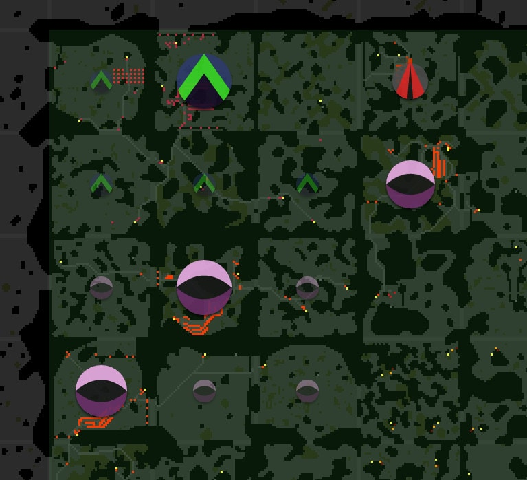

# screeps_helper

---
This is a place to hold some basic building blocks for screeps_world, the scripts may be useful for a wide range of purposes, but you need to carefully arrange them with required support(libraries etc.), always check the date of the codes before using them!
---
